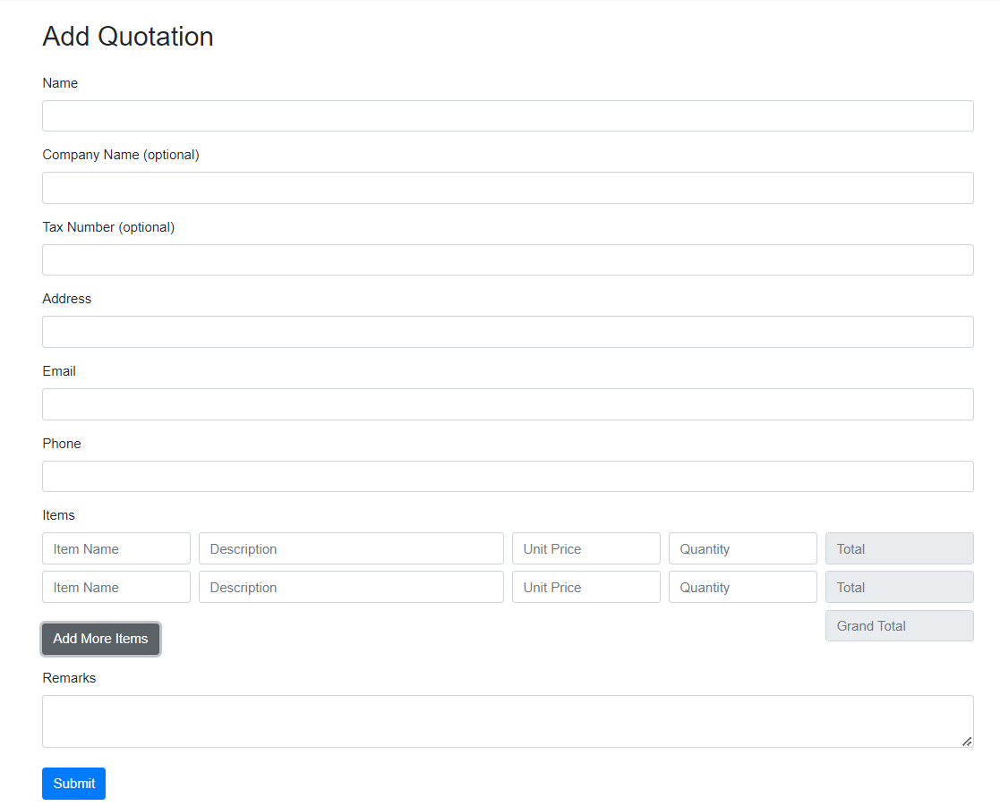
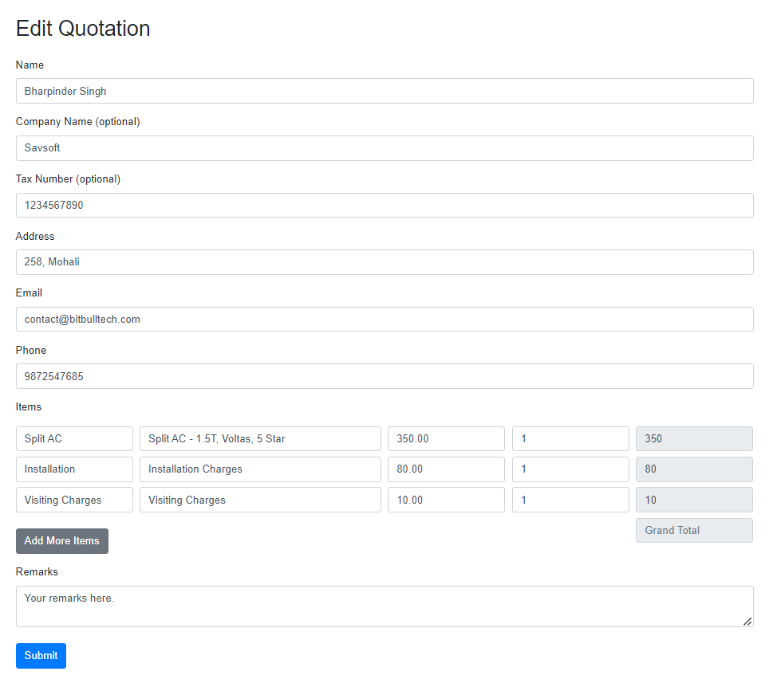
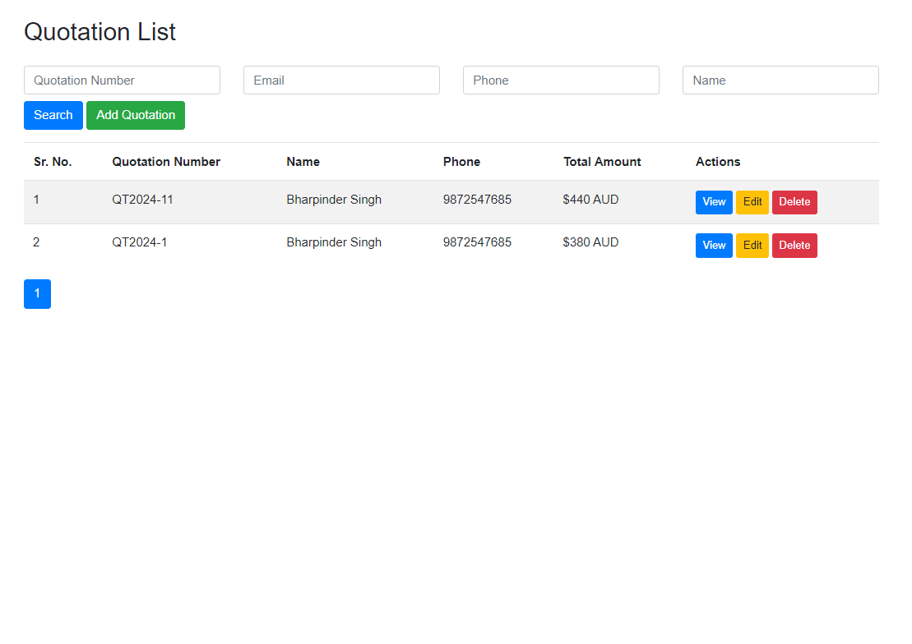
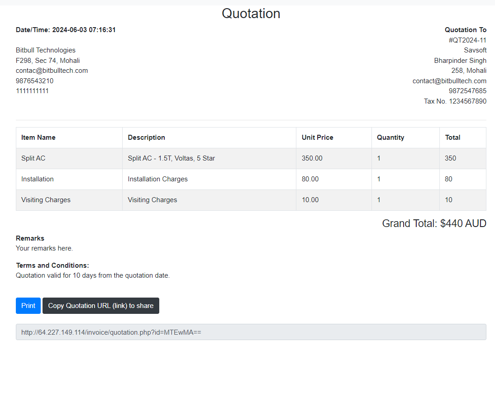

# Bit-Quotation
<b>Create and share quotation with your client.</b>
1) Add Quotation 
2) Quotation list
3) Edit Quotation
4) Share quotation URL

<b>Screenshot</b> 
<kbd></kbd>
<kbd></kbd>
<kbd></kbd>
<kbd></kbd>

  
<b>Insallation</b> 
1) Upload files
2) Import database.sql 
3) Edit config.php with database credentials and other variables

<b>Default credentials</b> 
Username: admin 
Password: admin 
  

Contact us for cusomized solution, modification, installation and support. 
Email: contact@bitbulltech.com

